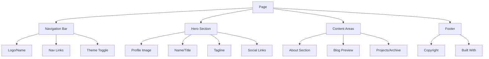

# Personal Website Redesign Specification

## Project Overview

- **Project Name**: Rishabh Malhotra Portfolio Redesign
- **Type**: Personal Website (Portfolio + Blog)
- **Core Functionality**: Professional portfolio showcasing backend engineering work at Block, with an Astrodynamics blog
- **Target Audience**: Recruiters, fellow engineers, space/rocket enthusiasts

### Current State Analysis

| Aspect | Current | Issues |
|--------|---------|--------|
| Build System | Webpack + PostCSS | Good foundation |
| Animations | 3+ competing effects | Overwhelming, performance-heavy |
| 3D Graphics | Three.js starfield | Heavy payload (~120KB) |
| Layout | W3.CSS based | Complex, inconsistent |
| Theme | Rainbow gradient | Dated, distracting |

---

## Design Direction: Terminal/Code Aesthetic

A refined terminal-inspired design that reflects backend engineering identity while maintaining professionalism. The aesthetic draws from classic terminal interfaces but with modern refinements—no full retro CRT effects, just subtle nods to the terminal aesthetic.

### Core Philosophy

1. **Content-First**: Animations serve content, not the other way around
2. **Performance**: Every byte must justify its existence
3. **Distinctive yet Professional**: Creative without being distracting

---

## 1. Visual Design System

### 1.1 Color Palette

```css
:root {
  /* Primary - Terminal Green (classic, readable) */
  --color-primary: #00ff9d;
  --color-primary-dim: #00cc7d;
  --color-primary-glow: rgba(0, 255, 157, 0.15);
  
  /* Secondary - Warm accent for links/highlights */
  --color-accent: #ff6b6b;
  --color-accent-dim: #cc5656;
  
  /* Background - Deep, not pure black */
  --color-bg-primary: #0a0a0a;
  --color-bg-secondary: #111111;
  --color-bg-tertiary: #1a1a1a;
  --color-bg-elevated: #222222;
  
  /* Text */
  --color-text-primary: #e0e0e0;
  --color-text-secondary: #888888;
  --color-text-muted: #555555;
  
  /* Syntax highlighting colors (for code blocks) */
  --color-syntax-keyword: #ff79c6;
  --color-syntax-string: #f1fa8c;
  --color-syntax-comment: #6272a4;
  --color-syntax-function: #50fa7b;
  --color-syntax-number: #bd93f9;
}
```

**Rationale**: The terminal green (#00ff9d) provides excellent contrast against dark backgrounds while feeling authentic to the terminal aesthetic. It's also easier on the eyes than bright white. The warm accent (#ff6b6b) adds personality without overwhelming.

### 1.2 Typography

```css
:root {
  /* Primary Font - Monospace (terminal feel) */
  --font-mono: 'JetBrains Mono', 'Fira Code', 'SF Mono', 
               'Monaco', 'Inconsolata', 'Roboto Mono', monospace;
  
  /* Secondary Font - Clean sans-serif for readability */
  --font-sans: 'Inter', -apple-system, BlinkMacSystemFont, 
               'Segoe UI', sans-serif;
  
  /* Font Sizes - Based on 16px base */
  --text-xs: 0.75rem;      /* 12px */
  --text-sm: 0.875rem;     /* 14px */
  --text-base: 1rem;       /* 16px */
  --text-lg: 1.125rem;    /* 18px */
  --text-xl: 1.5rem;       /* 24px */
  --text-2xl: 2rem;        /* 32px */
  --text-3xl: 2.5rem;      /* 40px */
  --text-4xl: 3.5rem;     /* 56px */
  
  /* Line Heights */
  --leading-tight: 1.25;
  --leading-normal: 1.5;
  --leading-relaxed: 1.75;
}
```

**Usage**:
- Body text: Monospace for authentic terminal feel
- Headings: Sans-serif (Inter) for visual hierarchy
- Code blocks: Monospace with syntax highlighting

**Font Loading Strategy**:
```html
<!-- Preconnect for performance -->
<link rel="preconnect" href="https://fonts.googleapis.com">
<link rel="preconnect" href="https://fonts.gstatic.com" crossorigin>
<!-- Load Inter (sans-serif) -->
<link href="https://fonts.googleapis.com/css2?family=Inter:wght@400;500;600;700&display=swap" rel="stylesheet">
<!-- Load JetBrains Mono with swap for performance -->
<link href="https://fonts.googleapis.com/css2?family=JetBrains+Mono:wght@400;500&display=swap" rel="stylesheet">
```

### 1.3 Spacing System

```css
:root {
  /* Base spacing unit: 4px */
  --space-1: 0.25rem;   /* 4px */
  --space-2: 0.5rem;   /* 8px */
  --space-3: 0.75rem;  /* 12px */
  --space-4: 1rem;     /* 16px */
  --space-5: 1.5rem;   /* 24px */
  --space-6: 2rem;     /* 32px */
  --space-8: 3rem;     /* 48px */
  --space-10: 4rem;    /* 64px */
  --space-12: 6rem;    /* 96px */
  --space-16: 8rem;    /* 128px */
}
```

### 1.4 Visual Effects

| Effect | Implementation | Use Case |
|--------|-----------------|----------|
| Glow | `box-shadow: 0 0 20px var(--color-primary-glow)` | Active elements, terminal cursor |
| Scanlines | CSS pseudo-element (subtle) | Optional decorative |
| Border | 1px solid with slight glow | Cards, code blocks |
| Cursor Blink | CSS animation (1s) | Typing indicator |

---

## 2. Layout Specification

### 2.1 Page Structure



### 2.2 Navigation

**Structure**: Fixed top navigation, minimal height

```html
<nav class="nav">
  <div class="nav-container">
    <a href="/" class="nav-logo">
      <span class="prompt">$</span> rm
    </a>
    <ul class="nav-links">
      <li><a href="#about">~/about</a></li>
      <li><a href="/Astrodynamics/">~/blog</a></li>
      <li><a href="#contact">~/contact</a></li>
    </ul>
  </div>
</nav>
```

**Styling**:
- Height: 56px (compact)
- Background: Semi-transparent with backdrop blur
- Active state: Terminal prompt style (`~/`)
- Hover: Subtle glow effect

### 2.3 Hero Section

**Layout**: Centered content with profile image

```html
<section class="hero">
  <div class="hero-content">
    <div class="profile-image-container">
      
      <div class="status-indicator"></div>
    </div>
    
    <h1 class="hero-title">
      <span class="prompt">></span> Rishabh Malhotra
      <span class="cursor">_</span>
    </h1>
    
    <p class="hero-subtitle">
      Backend Engineer @ <code class="inline-code">Block</code>
    </p>
    
    <div class="hero-code">
      <pre><code><span class="keyword">def</span> <span class="function">who_am_i</span>():
    <span class="keyword">return</span> {
        <span class="string">'role'</span>: <span class="string">'Backend Engineer'</span>,
        <span class="string">'company'</span>: <span class="string">'Block'</span>,
        <span class="string">'location'</span>: <span class="string">'San Francisco'</span>,
        <span class="string">'interests'</span>: [<span class="string">'Astrodynamics'</span>, <span class="string">'Space'</span>],
        <span class="string">'education'</span>: <span class="string">"Dean's Hons - UW CS"</span>
    }</code></pre>
    </div>
    
    <div class="hero-links">
      <a href="https://github.com/rishabhmalhotra" class="hero-link" target="_blank">
        <svg>GitHub</svg>
      </a>
      <a href="https://linkedin.com/in/rishmalho" class="hero-link" target="_blank">
        <svg>LinkedIn</svg>
      </a>
      <a href="https://twitter.com/rishmalho" class="hero-link" target="_blank">
        <svg>Twitter</svg>
      </a>
    </div>
  </div>
</section>
```

### 2.4 Sections

| Section | Content | Layout |
|---------|---------|--------|
| About | Brief bio, education, current role | Single column, max-width 720px |
| Blog Preview | Recent 3 posts from Astrodynamics | Card grid (responsive) |
| Contact | Email, social links | Centered list |

### 2.5 Responsive Breakpoints

```css
:root {
  --bp-sm: 640px;
  --bp-md: 768px;
  --bp-lg: 1024px;
  --bp-xl: 1280px;
}
```

| Breakpoint | Layout Changes |
|------------|----------------|
| < 640px | Single column, hamburger nav, smaller typography |
| 640px - 768px | Expanded spacing, inline nav items |
| > 768px | Full layout, all effects enabled |

---

## 3. Animation Strategy

### 3.1 Principles

1. **Subtle**: Animations should be barely perceptible
2. **Meaningful**: Every animation conveys information
3. **Performant**: Use CSS transforms, avoid layout thrashing
4. **Respectful**: Respect `prefers-reduced-motion`

### 3.2 Approved Animations

| Animation | Type | Duration | Trigger | Purpose |
|-----------|------|----------|---------|----------|
| Cursor Blink | CSS keyframes | 1s infinite | Always | Terminal indicator |
| Text Reveal | CSS + JS | 50ms per char | Page load | Initial greeting |
| Link Hover | CSS transition | 200ms | Hover | Feedback |
| Section Fade | CSS transition | 300ms | Scroll | Entry animation |
| Code Typing | JS typewriter | 30ms per char | Page load | Show code snippet |

### 3.3 Implementation Details

**Cursor Blink**:
```css
.cursor {
  animation: blink 1s step-end infinite;
}

@keyframes blink {
  0%, 100% { opacity: 1; }
  50% { opacity: 0; }
}
```

**Section Fade-In**:
```css
.fade-in {
  opacity: 0;
  transform: translateY(20px);
  transition: opacity 0.3s ease, transform 0.3s ease;
}

.fade-in.visible {
  opacity: 1;
  transform: translateY(0);
}
```

### 3.4 Animations to REMOVE

| Animation | Reason |
|-----------|--------|
| Gradient background | Distracting, performance-heavy |
| Text decryption effect | Overly complex for minimal design |
| Three.js starfield | Heavy payload, not essential |
| Company typewriter (complex) | Keep simplified version |

---

## 4. Component Breakdown

### 4.1 Core Components

| Component | States | Behavior |
|-----------|--------|----------|
| NavLink | default, hover, active | Underline animation on hover |
| CodeBlock | default, highlighted | Syntax highlighting, copy button |
| ProfileImage | default, loading | Lazy load, placeholder |
| SocialIcon | default, hover | Scale + color on hover |
| BlogCard | default, hover | Lift effect on hover |
| Button | default, hover, active | Background transition |

### 4.2 Component Specifications

**NavLink**:
```css
.nav-link {
  position: relative;
  color: var(--color-text-secondary);
  transition: color 0.2s ease;
}

.nav-link::after {
  content: '';
  position: absolute;
  bottom: -4px;
  left: 0;
  width: 0;
  height: 1px;
  background: var(--color-primary);
  transition: width 0.2s ease;
}

.nav-link:hover {
  color: var(--color-primary);
}

.nav-link:hover::after {
  width: 100%;
}
```

**CodeBlock**:
```css
.code-block {
  background: var(--color-bg-secondary);
  border: 1px solid var(--color-bg-tertiary);
  border-radius: 8px;
  padding: var(--space-4);
  overflow-x: auto;
  position: relative;
}

.code-block pre {
  margin: 0;
  font-family: var(--font-mono);
  font-size: var(--text-sm);
  line-height: 1.7;
}
```

**BlogCard**:
```css
.blog-card {
  background: var(--color-bg-secondary);
  border: 1px solid var(--color-bg-tertiary);
  border-radius: 8px;
  padding: var(--space-5);
  transition: transform 0.2s ease, box-shadow 0.2s ease;
}

.blog-card:hover {
  transform: translateY(-4px);
  box-shadow: 0 8px 24px rgba(0, 0, 0, 0.3);
}
```

---

## 5. Technical Approach

### 5.1 File Structure

```
personalwebsite/
├── src/
│   ├── css/
│   │   ├── _variables.css      # Design tokens
│   │   ├── _reset.css          # CSS reset
│   │   ├── _typography.css     # Font settings
│   │   ├── _components.css     # Reusable components
│   │   ├── _layout.css         # Page layout
│   │   ├── _animations.css    # Animation keyframes
│   │   └── main.css            # Entry point
│   └── js/
│       ├── app.js              # Main entry
│       └── modules/
│           ├── cursor.js       # Cursor effects
│           ├── typewriter.js   # Code typing
│           └── observer.js     # Intersection observer
├── index.html                  # Homepage
├── Astrodynamics/
│   ├── index.html              # Blog listing
│   └── posts/                  # Blog posts
└── dist/                       # Built files
```

### 5.2 CSS Architecture

**Approach**: Utility-first with semantic classes (similar to Tailwind but custom)

```css
/* _variables.css - Single source of truth */
:root {
  /* All design tokens here */
}

/* _reset.css - Minimal reset */
*, *::before, *::after {
  box-sizing: border-box;
  margin: 0;
  padding: 0;
}

/* _components.css - Reusable UI pieces */
.btn { /* ... */ }
.card { /* ... */ }
.code-block { /* ... */ }

/* _layout.css - Page structure */
.container { /* ... */ }
.hero { /* ... */ }
.section { /* ... */ }

/* _animations.css - Keyframes */
@keyframes blink { /* ... */ }
@keyframes fadeIn { /* ... */ }
```

### 5.3 JavaScript Modules

| Module | Purpose | Size Target |
|--------|---------|-------------|
| cursor.js | Blinking cursor effect | < 1KB |
| typewriter.js | Typing animation for code | < 2KB |
| observer.js | Scroll-triggered animations | < 1KB |
| app.js | Initialization | < 1KB |

**Total JS Target**: < 10KB gzipped

### 5.4 Performance Targets

| Metric | Target |
|--------|--------|
| First Contentful Paint | < 1.5s |
| Largest Contentful Paint | < 2.5s |
| Total JavaScript | < 50KB gzipped |
| Total CSS | < 20KB gzipped |
| Lighthouse Performance | > 90 |

### 5.5 Browser Support

```json
{
  "browsers": [
    "last 2 Chrome versions",
    "last 2 Firefox versions",
    "last 2 Safari versions",
    "last 2 Edge versions"
  ]
}
```

---

## 6. Page-by-Page Specifications

### 6.1 Homepage (index.html)

**Layout**:
```
┌─────────────────────────────────────┐
│  Nav: $ rm  ~/about ~/blog ~/contact│
├─────────────────────────────────────┤
│                                     │
│         ┌─────────────┐            │
│         │  [Profile]  │            │
│         │   Image     │            │
│         └─────────────┘            │
│                                     │
│    > Rishabh Malhotra_             │
│                                     │
│    Backend Engineer @ Block        │
│                                     │
│    ┌─────────────────────────┐    │
│    │ def who_am_i():         │    │
│    │   return {              │    │
│    │     'role': 'Backend',  │    │
│    │     'company': 'Block' │    │
│    │   }                     │    │
│    └─────────────────────────┘    │
│                                     │
│    [GitHub] [LinkedIn] [Twitter]  │
│                                     │
├─────────────────────────────────────┤
│  About Section (brief)              │
├─────────────────────────────────────┤
│  Recent Blog Posts (3 cards)        │
├─────────────────────────────────────┤
│  Footer                            │
└─────────────────────────────────────┘
```

### 6.2 Astrodynamics Blog (Astrodynamics/index.html)

**Layout**:
```
┌─────────────────────────────────────┐
│  Nav: $ rm  ~/home ~/blog          │
├─────────────────────────────────────┤
│                                     │
│  > cd ~/Astrodynamics               │
│                                     │
│  Astrodynamics                      │
│  A critical examination of rocket   │
│  propulsion and physics of space    │
│                                     │
│  ┌─────────────────────────────┐   │
│  │ Post 1: The Tyranny of...   │   │
│  │ July 2025 | Part 1          │   │
│  │ Excerpt text...             │   │
│  └─────────────────────────────┘   │
│                                     │
│  ┌─────────────────────────────┐   │
│  │ Post 2: Coming Soon...     │   │
│  └─────────────────────────────┘   │
│                                     │
├─────────────────────────────────────┤
│  Footer                            │
└─────────────────────────────────────┘
```

**Visual Changes**:
- Remove Three.js starfield
- Replace with subtle CSS background pattern (dot grid)
- Keep terminal-style headers

---

## 7. Migration Checklist

### Phase 1: Foundation
- [ ] Create new CSS file structure in `src/css/`
- [ ] Set up design tokens in `_variables.css`
- [ ] Implement CSS reset and base styles

### Phase 2: Components
- [ ] Build navigation component
- [ ] Build hero section
- [ ] Build code block component
- [ ] Build blog card component

### Phase 3: JavaScript
- [ ] Create minimal JS modules
- [ ] Implement cursor blink
- [ ] Implement typewriter effect
- [ ] Add scroll observer for fade-ins

### Phase 4: Pages
- [ ] Update index.html structure
- [ ] Update Astrodynamics/index.html structure
- [ ] Update blog post templates

### Phase 5: Polish
- [ ] Test responsive behavior
- [ ] Verify reduced-motion support
- [ ] Performance testing
- [ ] Cross-browser testing

---

## 8. Alternative: Minimal Dark Theme

If the terminal aesthetic feels too specific, here's an alternative "Minimal Dark" option:

```css
:root {
  --color-bg: #0d0d0d;
  --color-surface: #161616;
  --color-border: #2a2a2a;
  --color-text: #fafafa;
  --color-text-secondary: #a0a0a0;
  --color-accent: #3b82f6; /* Blue */
}
```

This would be cleaner and more versatile while still being distinctive.

---

## Summary

This specification provides a complete blueprint for redesigning your personal website with:

1. **Terminal/Code Aesthetic**: Authentic to your backend engineering identity
2. **Performance-First**: Minimal JavaScript, optimized loading
3. **Maintainable**: Clear CSS architecture, design tokens
4. **Distinctive**: Creative without being overwhelming

The implementation should result in a Lighthouse score of 90+ while maintaining your unique personality through subtle terminal-inspired design elements.
